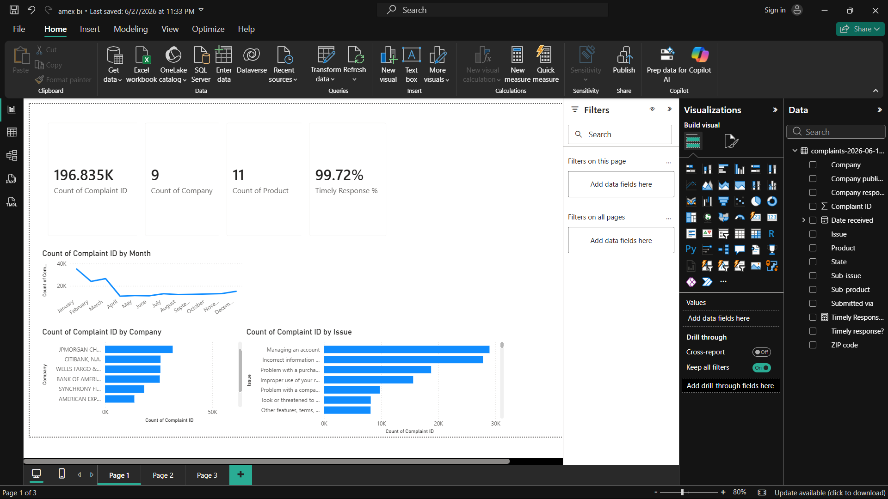
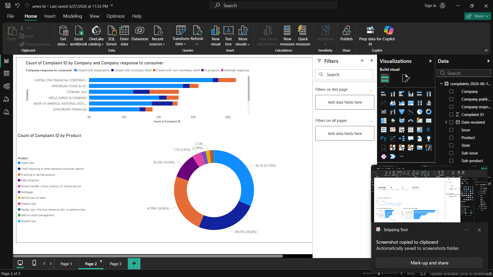

# American Express CFPB Complaints Analysis


## Project Overview

This project analyzes Consumer Financial Protection Bureau (CFPB) complaint data to identify customer pain points, complaint trends, and business risks affecting American Express. Using Python, SQL, and Power BI, the project delivers actionable insights and business recommendations to improve customer experience.

---

## Objectives

- Analyze complaint trends across financial institutions.
- Compare American Express with leading competitors.
- Identify high-impact complaint categories.
- Build interactive Power BI dashboards.
- Provide data-driven business recommendations.

---

## Tech Stack

- Python
- Pandas
- NumPy
- SQL
- Power BI
- Matplotlib
- Jupyter Notebook

---

## Repository Structure

```
american-express-cfpb-complaints-analysis/
│
├── data/
├── notebooks/
├── powerbi/
├── presentation/
├── images/
└── README.md
```

---

## Dashboard Preview

### Executive Dashboard



### Complaint Analysis Dashboard



---

## Key Insights

- American Express accounted for approximately **6.9%** of all complaints in the dataset.
- Credit reporting issues were the most frequent complaint category.
- Purchase dispute complaints highlighted opportunities to improve dispute resolution.
- Complaint volumes increased throughout the analysis period, indicating rising customer expectations.

---

## Business Recommendations

- Improve dispute resolution efficiency.
- Increase promotional transparency.
- Enhance collections experience.
- Continuously monitor complaint trends using interactive dashboards.

---

## Results

- Analyzed 196,835 CFPB complaints across 9 financial institutions.
- Identified major complaint categories affecting customer satisfaction.
- Built interactive Power BI dashboards for executive reporting.
- Generated business recommendations to improve dispute resolution, promotional transparency, and collections experience.

---

## Files Included

- 📊 Power BI Dashboard (.pbix)
- 📓 Jupyter Notebook
- 📑 Executive Presentation (PDF)
- 📁 CFPB Complaint Dataset

---

## Author

**Aditya Sharma**

LinkedIn: https://www.linkedin.com/in/aditya-sharma-47a389216/
